# PHP Roadmap — A to Z

26 steps, one per letter. **A** is installing PHP. **Z** is a live website on the internet.

> 🎮 **Never written code before?** Do [`Php/stages.html`](Php/stages.html) first —
> 30 tiny syntax stages that get you from nothing to typing PHP without thinking about it.
> That's step A below, broken into 30 pieces.
>
> **Interactive version with tick-boxes:** [`Php/roadmap.html`](Php/roadmap.html) — open it in a browser.
> **Drill the words:** [`Php/flashcards.html`](Php/flashcards.html) — 102 cards, 6 decks.
> **Play instead of revising:** [`Php/games/`](Php/games/) — 6 arcade games, an escape room, hangman.

---

```mermaid
flowchart TD
    A["A · Setup<br/>run your first file"]

    A --> B["B · echo & variables"]
    B --> C["C · Data types & strings"]
    C --> D["D · Operators"]
    D --> E["E · Conditions"]
    E --> F["F · Loops"]
    F --> G["G · Arrays"]
    G --> H["H · Functions"]
    H --> I["I · PROJECT 1<br/>Grade Calculator"]

    I --> J["J · Forms & POST"]
    J --> K["K · Validation & security"]
    K --> L["L · Sessions"]
    L --> M["M · PROJECT 2<br/>To-Do List"]

    M --> N["N · SQL & database thinking"]
    N --> O["O · PHP talks to MySQL"]
    O --> P["P · Prepared statements"]

    P --> Q["Q · Includes & page structure"]
    Q --> R["R · URL parameters"]
    R --> S["S · Search & redirect"]
    S --> T["T · PROJECT 3<br/>Student Manager"]

    T --> U["U · Login & password hashing"]
    U --> V["V · PDO"]
    V --> W["W · Relationships & JOINs"]
    W --> X["X · Uploads & pagination"]
    X --> Y["Y · OOP, exceptions, Composer"]
    Y --> Z["Z · API, fetch, Git & deploy"]

    Z --> END(["Your site is live 🎉"])

    classDef start fill:#e8e7f6,stroke:#5c62a8,stroke-width:2px,color:#14162b
    classDef lang fill:#ffffff,stroke:#c8c4de,color:#14162b
    classDef hard fill:#fdf0e0,stroke:#b4690e,stroke-width:2px,color:#14162b
    classDef proj fill:#e6f2ea,stroke:#2f7a4f,stroke-width:2px,color:#14162b
    classDef adv fill:#f4f3fa,stroke:#9a97c4,stroke-dasharray:4 3,color:#14162b
    classDef done fill:#e8e7f6,stroke:#5c62a8,stroke-width:2px,color:#14162b

    class A start
    class B,C,D,E,F,H,J,K,L,N,O,P,Q,R,S lang
    class G hard
    class I,M,T proj
    class U,V,W,X,Y,Z adv
    class END done
```

**Reading the colours:** white = a normal lesson · 🟠 orange = the hard one everyone
trips on · 🟢 green = a project you build yourself · dashed = after the course ends.

---

## The steps in detail

### Zone 0 — Getting ready

| | Step | What you can do after it | Where |
|---|---|---|---|
| **A** | Setup | Run a PHP file and know why a `.php` file can't be double-clicked | `Php/00-setup/` |

### Zone 1 — The language *(textbook Ch. 10)*

| | Step | What you can do after it | Where |
|---|---|---|---|
| **B** | echo & variables | Print things; store values and reuse them | `01-basics/` |
| **C** | Data types & strings | Know what a value *is*; cut, join and change text | `02-datatypes/` |
| **D** | Operators | Do maths; compare two things; combine conditions | `03-operators/` |
| **E** | Conditions | Make the code choose between paths | `04-conditions/` |
| **F** | Loops | Repeat something 10 or 10,000 times without repeating yourself | `05-loops/` |
| **G** | **Arrays** ⚠️ | Hold many values in one name — this is the big jump | `06-arrays/` |
| **H** | Functions | Write your own commands and reuse them | `07-functions/` |
| **I** | 🏗 Project 1 | Build a full grade report on your own | `projects/project-1-grades/` |

> **G is the wall.** Everything from J onwards is built on arrays. Don't move past it until
> it feels obvious — no shame in spending two sessions here, it's the normal cost.

### Zone 2 — The web *(textbook Ch. 10)*

| | Step | What you can do after it | Where |
|---|---|---|---|
| **J** | Forms & POST | Take input from a real person and use it | `08-forms/` |
| **K** | Validation & security | Refuse bad input; stop injected scripts | `08-forms/register.php` |
| **L** | Sessions | Remember things between page loads | `games/guess-number.php` |
| **M** | 🏗 Project 2 | Build a working to-do list | `projects/project-2-todo/` |

### Zone 3 — The database *(textbook Ch. 11)*

| | Step | What you can do after it | Where |
|---|---|---|---|
| **N** | SQL & database thinking | Design a table; read and write rows with SQL | `09-mysql/` |
| **O** | PHP talks to MySQL | Show real database rows on a web page | `09-mysql/02-select.php` |
| **P** | Prepared statements | Write queries that can't be hacked | `09-mysql/03-insert.php` |

### Zone 4 — The real thing *(textbook Ch. 12)*

| | Step | What you can do after it | Where |
|---|---|---|---|
| **Q** | Includes & structure | Share a header and footer across every page | `10-dynamic-page/includes/` |
| **R** | URL parameters | Build "click an item → see its page" | `10-dynamic-page/detail.php` |
| **S** | Search & redirect | Add a search box; stop double-submits | `10-dynamic-page/index.php` |
| **T** | 🏗 Project 3 | A complete database-driven site, start to finish | `projects/project-3-students/` |

**T is the finish line for the course.** Everything below is extra.

### Zone 5 — Beyond the course

| | Step | What you can do after it |
|---|---|---|
| **U** | Login & password hashing | Real accounts, with passwords stored safely |
| **V** | PDO | The other database API — the one most jobs use |
| **W** | Relationships & JOINs | Several tables that know about each other |
| **X** | Uploads & pagination | Profile pictures; "page 2 of 7" |
| **Y** | OOP, exceptions, Composer | Write code the way professionals structure it |
| **Z** | API, fetch, Git & deploy | Your site, live on a real URL, updating without reloading |

---

## Where you are now

Track this in [`PROGRESS.md`](PROGRESS.md) after every session — and tick the boxes in
[`Php/roadmap.html`](Php/roadmap.html), which remembers them in your browser.

**Current position: not started — next step is A.**
